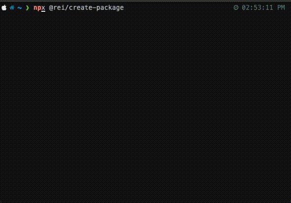

# Create package

The officially supported way to create NPM packages at [REI](https://www.rei.com/).

With `@rei/create-package`, you can quickly scaffold:

- a [Vue](https://vuejs.org/) component compiled by [Vite](https://vitejs.dev/) and configured with REI default settings
- a vanilla TypeScript library that's ready to be imported into your application
- Alpine microsite front-end code and configuration

Report bugs in the [issues](https://github.com/rei/create-package/issues) tab.

## Usage

```sh
npx @rei/create-package@^1 #(JavaScript)
```

or

```sh
npx @rei/create-package@^2 #(TypeScript)
```

<p align='center'>

</p>

## TypeScript and JavaScript versions

The initializer can scaffold out either JavaScript or TypeScript code depending on the version you run the initializer with. If you don't specify the version, the initializer will default to the latest version, currently `2.^` (TypeScript).

## CLI

### Commands

#### `npx @rei/create-package[@version]`

This command is preset to generate a Vue 3 project from the `templates/vue` template directory. See the options section to inspect default values for options used by the command.

- Create a Vue 3 NPM package called "carousel"

```sh
npx @rei/create-package --name carousel
```

- Create a vanilla TypeScript library

```sh
npx @rei/create-package --name lib --template vanilla
```

- Microsite code and configuration. This scaffolds out the front-end [QuickStart microsite code](https://git.rei.com/projects/QM/repos/quickstart-microsite/browse) and build/test configuration.

From the front-end root package directory:

```sh
npx @rei/create-package --name <microsite name> --template microsite --no-dir
```

#### `npx @rei/create-package [interactive|i]`

Use "interactive mode" to follow command prompts to generate an NPM package.

### Options

`-n, --name <package-name>`

The name of the NPM package we're initializing. Defaults to `my-package`

`-d, --desc <description>`

The description of the NPM package we're initializing. Defaults to `description`

`-a, --author <author-name>`

The author of the NPM package we're initializing. Attempts to resolve the user's git username and email, otherwise defaults to `REI`.

`-t, --template [vue|vanilla|microsite]`

The type of template we're initializing. Defaults to `vue`.

`--no-dir`

Using this option will tell the initializer to output to the current working directory, instead of creating a namespaced directory matching the package name.

## Anatomy

`@rei/create-package` is an [NPM initializer](https://docs.npmjs.com/cli/v9/commands/npm-init) written in Node.js.

Its mechanics are written to be agnostic of any particular technology's generator. Meaning it doesn't rely on [Vue CLI](https://cli.vuejs.org/) or anything similar.

The logic recurses through the chosen template files and uses a [template system](https://www.npmjs.com/package/mustache) to inject contextual data into them.

### Templates

Templates are divided by type in their directories. Template directories contain contextual files relevant to their type.

```
@rei/create-package
├── templates
│   ├── common
│   │   ├── .gitlab-ci.yml
│   │   └── .npmrc
│   ├── vue
│   ├── vanilla
│   └── microsite

...
```

`common` is a directory of shared files that are output for every template type.

### Environment variables

`@rei/create-packages` uses `dotenv` (and `.env`) to hold configuration variables that are injected into necessary templates.

## GitLab CI

This tool helps you scaffold out a new NPM package but it doesn't set up source control management (SCM) or a CI/CD pipeline, features that you'll want to facilitate the growth and maturity of your package.

We use GitLab for SCM and CI/CD. Create a new project in GitLab and use `@rei/create-package` to scaffold it. When creating an NPM package, `@rei/create-package` includes a `.gitlab-ci.yml`, which sets up the necessary pipelines you'll need downstream.

## Contributing

Modify existing templates freely. Add environmental variables to `.env` to make them available for render.

Adding a new template is a more involved process. You'll need to create a new template directory and then ensure the Node scripts can process it.

For help, reach out to the [#alpine-frontend-users](https://rei.slack.com/archives/CLWJC9FFW) slack channel.
